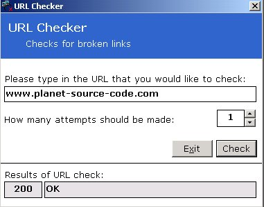



## URL Checker

### Description

Allows you to check URLs. Could be used to trawl through a database a report broken links.
 
### More Info
 
a URL and the number of retries

Code is commented and easy to follow

Returns the code and description reported by the component. 200 Successful, 404 Page not found etc

             |
---                |---
**Submitted On**   |2002-03-15 10:58:18
**By**             |[Rob J Barnard](https://github.com/Planet-Source-Code/PSCIndex/blob/master/ByAuthor/rob-j-barnard.md)
**Level**          |Intermediate
**User Rating**    |4.8 (19 globes from 4 users)
**Compatibility**  |VB 6\.0
**Category**       |[Internet/ HTML](https://github.com/Planet-Source-Code/PSCIndex/blob/master/ByCategory/internet-html__1-34.md)
**World**          |[Visual Basic](https://github.com/Planet-Source-Code/PSCIndex/blob/master/ByWorld/visual-basic.md)
**Archive File**   |[URL\_Checke623703152002\.zip](https://github.com/Planet-Source-Code/rob-j-barnard-url-checker__1-32706/archive/master.zip)

